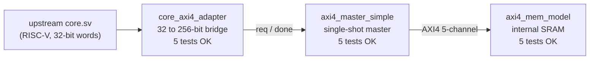

<!--
SPDX-License-Identifier: CC-BY-SA-4.0
Copyright (c) 2026 PopSolutions Cooperative
Originally based on hughperkins/VeriGPU (MIT, 2022) — see NOTICE.md
-->

# MAST — PopSolutions Sails IP trunk

> The mast where every Sail attaches.

**MAST** is the shared open-hardware IP foundation for **PopSolutions Sails**, a fleet of RISC-V GPUs targeting AI inference and training workloads with a focus on Global South sovereignty, reparability, and cooperative ownership.

This project is a fork of [hughperkins/VeriGPU](https://github.com/hughperkins/VeriGPU) (MIT, 2022). Hugh's academic foundation made this possible. PopSolutions extends MAST into a production roadmap toward silicon, with the explicit goal of shipping affordable open-hardware accelerators that can be repaired, audited, and locally manufactured.

PopSolutions is a Brazilian digital cooperative. See [popsolutions.co](https://popsolutions.co).

## Status

**Tests passing: 15/15 across 3 verified modules.** See [`verif/HOW_TO_VERIFY.md`](verif/HOW_TO_VERIFY.md) for a plain-language guide to checking this for yourself (no SystemVerilog required — just one command).

### Verified modules

The full request chain — from the upstream RISC-V core's bespoke memory interface, through MAST's AXI4 subsystem, all the way to a behavioural memory model — is verified end-to-end in cocotb / Verilator.

### Sprint progress (FPGA-first prototype path)

| Sprint | Goal | Status |
|---|---|---|
| **A** | AXI4 master skeleton + cocotb harness | Done — 10 tests passing |
| **B** | Bridge upstream `core.sv` to AXI4 | Done — 5 tests passing |
| **C** | `inner_jib_top.sv` integration in InnerJib7EA | Next |
| **D** | Verilator end-to-end with `sum_ints.asm` running on the upstream core | Pending Sprint C |
| **E** | FPGA target board pick (Arty A7 / ULX3S / Kintex) | Pending |
| **F** | First bitstream on real FPGA hardware | Pending |
| **G** | TinyLlama-1.1B int4 reference workload on FPGA | Pending |
| **H** | Skywater 130nm Open MPW tape-out submission | 6–12 months out |

## What is MAST?

MAST holds the shared IP that every Sail product depends on:

- RISC-V core (RVA23 base + RVV 1.0 vectors + custom matrix extension `Xpop_matmul`)
- Compute Unit (parametrizable lane/vector width)
- Memory subsystem (DDR5 controller via LiteDRAM; HBM3 controller for high-tier products)
- AXI4 internal bus
- PCIe Gen5 host interface (via LitePCIe)
- Network-on-chip and inter-chiplet link (`MAST-link`, simple UCIe-precursor)
- Verification harness (Verilator + cocotb)
- Toolchain pinning and CI

Sail products vendor MAST as a git submodule pinned to a specific MAST release. When a Sail tape-outs to silicon, it freezes its MAST version forever — silicon is immutable.

## The Sails fleet

| Codename | SKU | Description | Design year | Status |
|---|---|---|---|---|
| InnerJib7EA | POPC_16A | Embedded entry SBC, 16 GB DDR5, monolithic Skywater 130nm | 2026 | starting |
| ForeTopsail7EA | POPC_128A | Inference mainstream, 128 GB DDR5, chiplet (compute 28nm + I/O 130nm) | 2026 | planned |
| MainTopsail7EA | POPH_80A | Training/fine-tuning, 80 GB HBM3 + 256 GB DDR5 tiered, chiplet | 2026 | planned |
| Spanker7EA | (n/a) | Software stack — driver, runtime, GGML/PyTorch backends | 2026 | planned |

See [`docs/popsolutions/NAMING.md`](docs/popsolutions/NAMING.md) for the full taxonomy (mast → product family → sail tier → SKU mapping). Codenames use 3-digit hexadecimal years: `7EA = 2026`, `7EB = 2027`, etc.

## License

This project is **dual-licensed** to balance commons protection with cooperative revenue.

| Layer | License |
|---|---|
| Hardware contributions added by PopSolutions (RTL, SystemVerilog, PCB design, datasheets) | [CERN-OHL-S v2](https://ohwr.org/cern_ohl_s_v2.txt) — strongly reciprocal |
| Software contributions added by PopSolutions (test infra, tooling, drivers, GGML backends) | Apache 2.0 |
| Documentation added by PopSolutions | CC-BY-SA 4.0 |
| Upstream code from hughperkins/VeriGPU | MIT (Hugh Perkins, 2022) — preserved |

A **commercial license** for hardware contributions is available for parties that prefer not to operate under the strongly reciprocal terms. Contact the cooperative.

See [`NOTICE.md`](NOTICE.md) for the per-file licensing structure and [ADR-001](docs/popsolutions/adr/0001-license.md) for the rationale.

## Contributing

See [`CONTRIBUTING.md`](CONTRIBUTING.md). Every commit requires a DCO `Signed-off-by:` line. We do not currently require a CLA.

## Governance

PopSolutions is a digital cooperative. Strategic decisions (license, tape-out commitments, financial) are made by the cooperative board following one-member-one-vote. Code-level decisions follow technical meritocracy via PR review and the ADR process.

See [`GOVERNANCE.md`](GOVERNANCE.md) (forthcoming) and [ADR-010](docs/popsolutions/adr/0010-governance.md).

## Plano Diretor (Project Charter)

See [`docs/popsolutions/PLANO_DIRETOR.md`](docs/popsolutions/PLANO_DIRETOR.md) for vision, non-goals, fleet roadmap, and the index of Architecture Decision Records.

## Upstream technical foundation

The technical content from VeriGPU upstream remains under [`docs/`](docs/) and continues to apply:

- [`docs/tech_details.md`](docs/tech_details.md) — instruction set, registers, memory model
- [`docs/planning.md`](docs/planning.md) — original system component status
- [`docs/verification.md`](docs/verification.md) — verification approach
- [`docs/metrics.md`](docs/metrics.md) — area and timing metrics

PopSolutions extensions and product-specific documentation live under [`docs/popsolutions/`](docs/popsolutions/).
